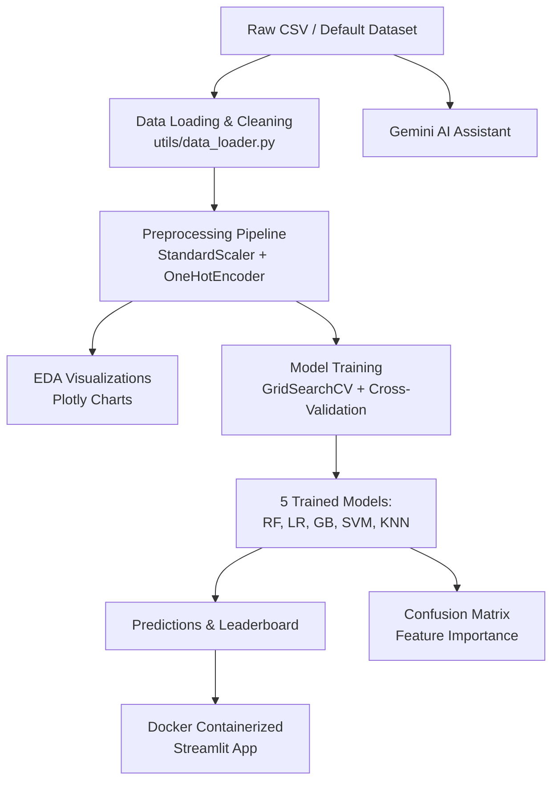

# 🚀 Telco Churn Analysis & Prediction Platform


> **Short Summary:** An end-to-end machine learning platform for telecommunications customer churn analysis and prediction, combining interactive EDA visualizations, automated model training with hyperparameter tuning, and an AI-powered Gemini assistant for insights.

---

## 📌 Executive Summary & Business Impact

* **The Problem:** Telecommunications companies lose billions annually to customer churn. Manual analysis is slow, error-prone, and lacks real-time predictive capability.
* **The Solution:** A Streamlit-based ML platform that lets analysts upload data, explore patterns interactively, train and compare 5 ML models with GridSearchCV, and predict individual churn probability — all with an integrated Gemini AI assistant.
* **Key Metrics & Results:** Model comparison leaderboards with accuracy, precision, recall, and F1 scores across Random Forest, Logistic Regression, Gradient Boosting, SVM, and KNN.

---

## 🏗️ System Architecture & Workflow



---

## 🛠️ Tech Stack & Key Tools

* **Core Language:** Python 3.10+
* **Data Processing:** Pandas, NumPy
* **Visualization:** Plotly, Seaborn, Matplotlib
* **Machine Learning:** Scikit-learn (GridSearchCV, RandomizedSearchCV)
* **API / UI Framework:** Streamlit
* **AI / LLM:** Google Generative AI (Gemini 2.0 Flash)
* **Deployment & Containerization:** Docker, Docker Compose
* **Environment Management:** python-dotenv

---

## 📂 Repository Directory Structure

```text
ML-MODELS-and-EDA-Streamlit/
├── app.py                  # Main Streamlit application entry point
├── pages/                  # Multi-page Streamlit modules
│   ├── Home.py
│   ├── EDA.py
│   ├── Model_Training.py
│   ├── Prediction.py
│   └── About.py
├── utils/                  # Utilities
│   ├── data_loader.py      # Data loading & cleaning
│   ├── preprocessing.py    # sklearn Pipelines
│   └── visualizations.py   # Plotly chart generators
├── models/                 # ML model training logic
│   ├── trainer.py
│   └── __init__.py
├── src/                    # Alternative standalone apps
│   ├── config.yaml
│   ├── edaapp.py
│   ├── telcochurnapp.py
│   ├── authenticationapp.py
│   └── __init__.py
├── data/                   # Sample datasets
│   ├── CleanedTelco.csv
│   ├── TestcleanedTelco.csv
│   └── telcocleaned.csv
├── images/                 # README assets
├── .env.example            # Environment template
├── .gitignore              # Git ignore rules
├── .dockerignore           # Docker build ignore rules
├── Dockerfile              # Container definition
├── docker-compose.yml      # Multi-service orchestration
├── requirements.txt        # Python dependencies (pinned)
├── LICENSE                 # MIT License
└── README.md               # This file
```

---

## ⚙️ Quickstart & Local Setup Guide

### Local Python Environment Setup

```bash
git clone https://github.com/ndumbe0/ML-MODELS-and-EDA-Streamlit.git
cd ML-MODELS-and-EDA-Streamlit
python -m venv .venv
# Windows:
.venv\Scripts\activate
# Linux/macOS:
source .venv/bin/activate
pip install -r requirements.txt
streamlit run app.py
```

### Docker Setup

```bash
# Build and run
docker-compose up --build
# Access at http://localhost:8501

# Or manually:
docker build -t telco-churn-app .
docker run -d -p 8501:8501 --env-file .env telco-churn-app
```

### AI Assistant Setup

Create a `.env` file in the project root:

```bash
cp .env.example .env
# Edit .env and add your Google AI API key
```

Get a [Google AI Studio API key](https://aistudio.google.com/apikey).

---

## 🛡️ Security & Quality Standards

* **Secrets Management:** API keys loaded from `.env` via `python-dotenv`, never hardcoded.
* **Prompt Injection Defense:** User inputs sanitized before sending to Gemini LLM.
* **Authentication:** Credentials loaded from environment variables (no hardcoded passwords).
* **Non-Root Execution:** Containerized as non-root `appuser`.
* **Dependency Pinning:** All packages have upper-bound version constraints.
* **Input Validation:** `try/except` blocks with logging on all critical code paths.

---

## 🧪 Testing

```bash
pip install pytest
pytest tests/ -v
```

---

## 👤 Author & Contact

* **GitHub:** [@ndumbe0](https://github.com/ndumbe0)
* **Email:** ndumbemoses@gmail.com
* **Team Lead:** Ms. Portia Bentum
* **Organization:** Azubi Africa

---

## 📄 License

This project is licensed under the MIT License — see the [LICENSE](LICENSE) file for details.
